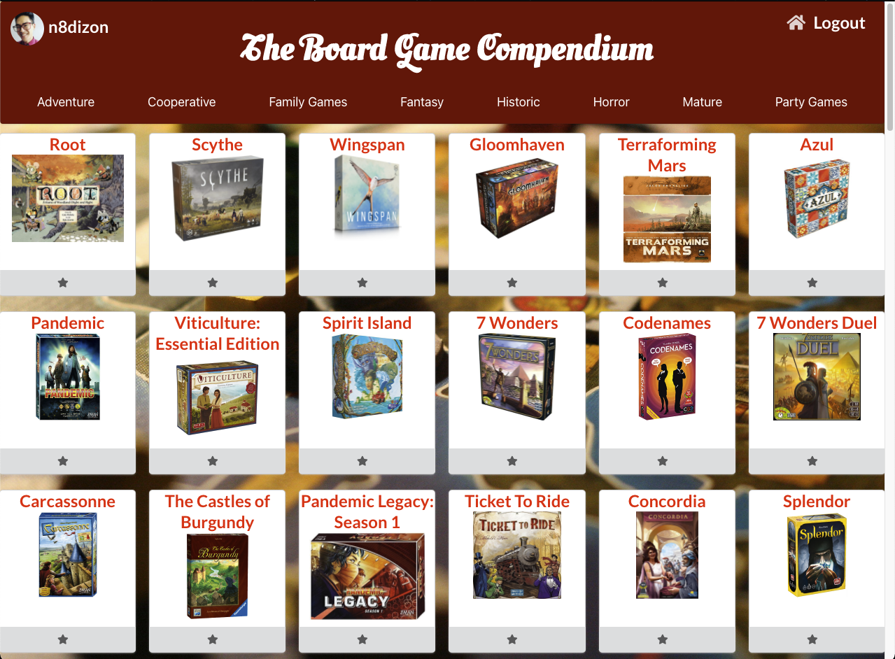
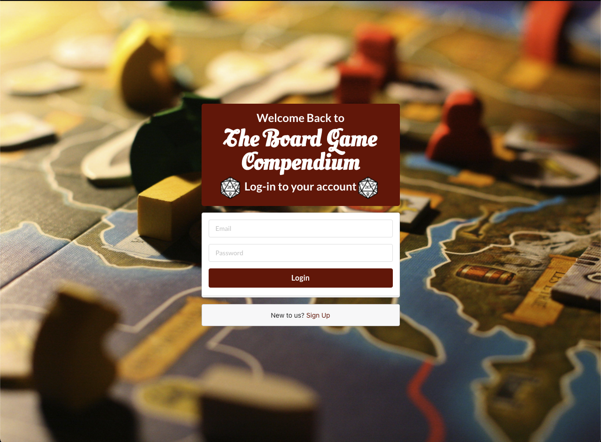
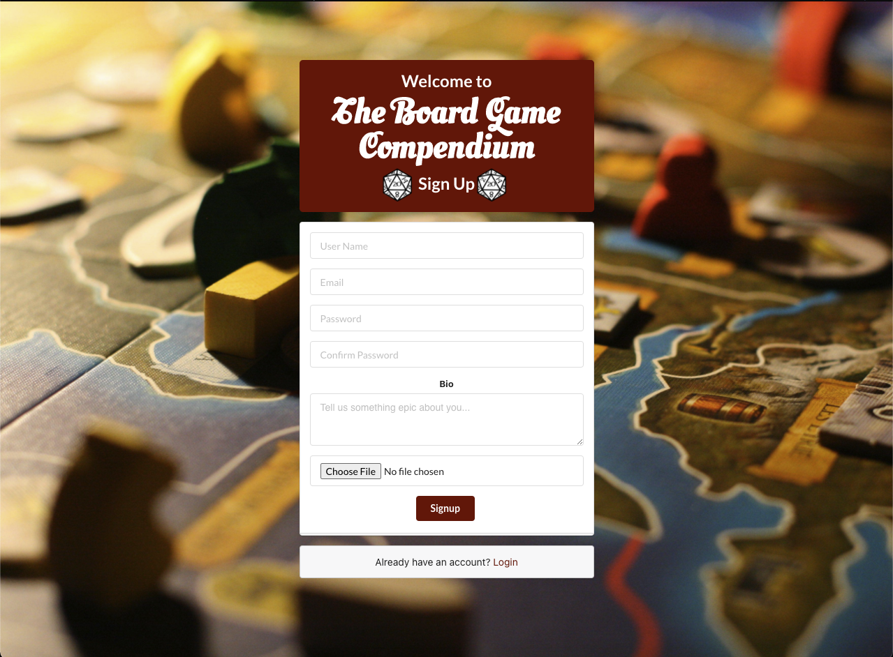

# The Board Game Compendium
If you and your friends are avid board game collectors like me, you'll know it's difficult to keep track of everything in your collection! The Board Game Compendium allows users to peruse through the vast library of almost every board game ever created and keep track of their collection on an easy-to-use app.

## Getting Started:
Visitors and users can find The Board Game Compendium by clicking the link [here](http://the-board-game-compendium.herokuapp.com/).

### 1. Login / Sign Up
Visitors will automatically be redirected to the Login Page where they can log in or sign up for an account. Signing up for an account requires the user to input a desired user name, email address, password, bio, and profile pic but upon returning, the user is only required to enter their email address and password to login.

 

### 2. Home Page (Board Games!)
After logging in or signing up, users will be redirected to the Home Page which shows a long list of the board game cards. Clicking the grey star button at the bottom of a board game card will add that game to the user's favorites. Once clicked, the button will change colors. Clicking the button again will remove the game from the user's favorites. A user can view all their favorite games from their Profile Page.

### 3. Detailed Game Page
Alternatively, a user can view game details by clicking on a board game's title or image. The user will then redirected to the board game's Game Page, the user can read information regarding the board game:
- Players
- Average play time
- Recommended minimum age
- Publishers of the game
- Release year
- Average user rating
- A description of the setting the players can expect

### 4. User Profile Page
Users can view their Profile Page by clicking on their username or profile picture in the top-left corner of the app. Here, the user can view all the cards of the games they've added to their favorites. They can also view a larger photo of their profile picture and their user bio. Users can remove board games from their favorites by clicking the star button at the bottom of the card.

### 5. The Page Header
Once logging in, users can use the Header component to navigate to important features of the app:
- The User Profile (top-left corner)
- All board games (home icon, top-right corner)
- Logout (top-right corner)

### The Board Game Atlas
This app is made possible by consuming the third party API, [Board Game Atlas](https://www.boardgameatlas.com/api/docs). 

## Technologies Used:
- MongoDB Atlas
- Express
- React
- Node
- Javascript
- CSS
- Heroku
- The Board Game Atlas

## What's Next?
This app is still under development and hopefully I'll be able to include several features soon!
- Currently there is a bug that prevents the user to login if they have games saved in their favorites. This is my first priority and I hope to implement these fixes as soon as possible!
- If a user is reading a game from its details page, it makes sense to add an 'Add to Favorites' button on that page too.
- My hope is to have this app extensively utilize Board Game Atlas' vast library of board games. The Board Games Page will soon be able to allow users to render a new list of board games based on the several categories in the Header.
- I plan to add a friends list feature to this app where...
    1. Users can add other users to their friends lists.
    2. Users can view other users' favorite board games.
    3. Users can schedule events to meet with other users and play specific games from one of their favorites.

### Note from the developer:
Though I'd like to focus on front-end development, utilizing my newly acquired skills from General Assembly is such a gratifying experience. Developing a full stack application in a week was challenging, but I couldn't have been more satisfied with my growth. If you'd like to connect with me to talk about this app, Software Development in general, or any and all board games, please feel free to reach out to me on GitHub or [LinkedIn](https://www.linkedin.com/in/nathaniel-dizon/)!